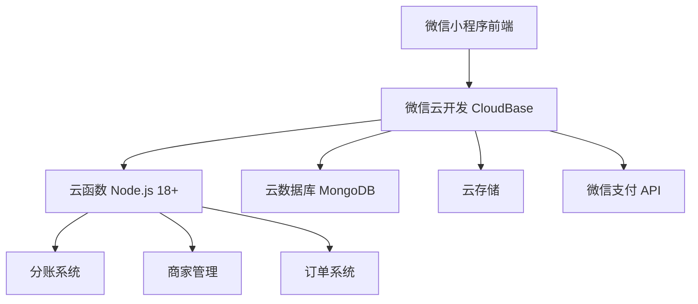
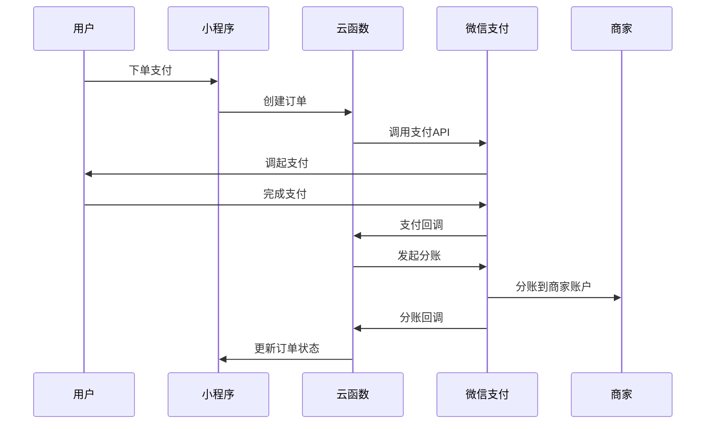
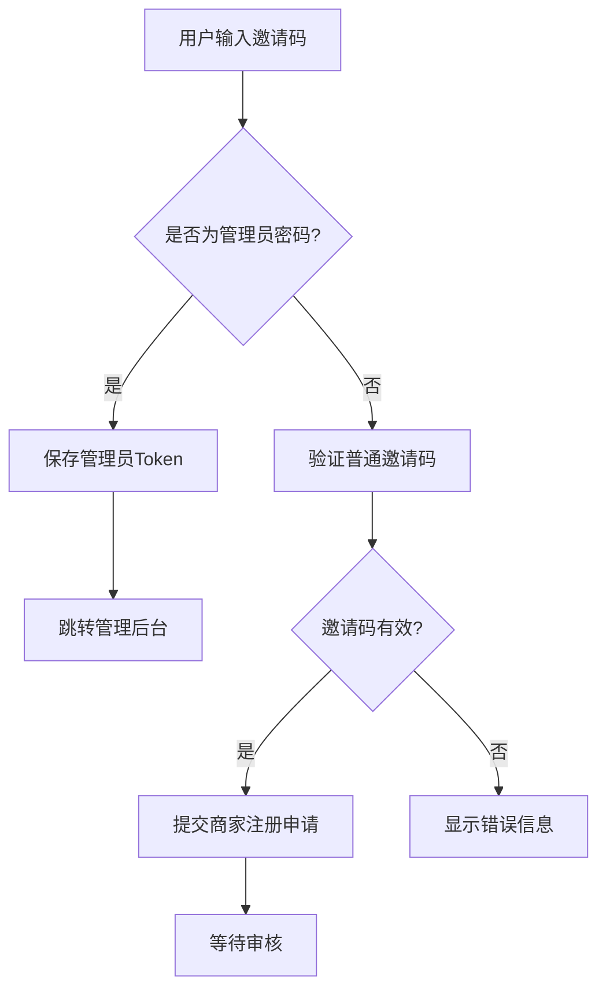
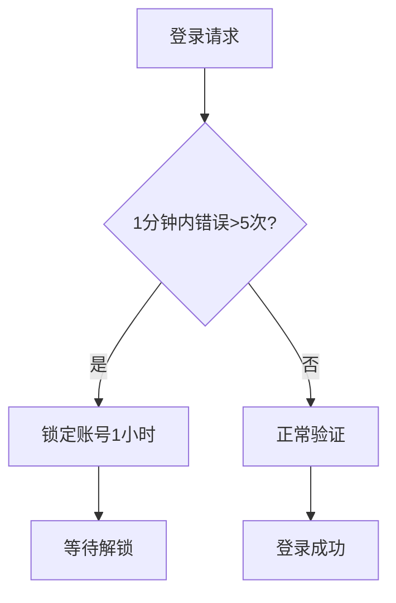

# 校园外卖微信小程序后端开发文档

## 📋 项目概述

开发一款为高校学生提供便捷外卖服务的微信小程序，整合校园及周边餐厅资源，解决学生"最后一公里"用餐问题。小程序包含用户端、商家端和管理后台三部分，支持从浏览、下单、支付到配送的全流程服务。

### 🎯 用户角色

| 角色 | 权限范围 | 主要功能 |
|------|----------|----------|
| **学生用户** | 用户端 | 浏览餐厅、下单、支付、查看订单 |
| **商家用户** | 商家端 | 管理店铺、处理订单、更新菜单 |
| **平台管理员** | 管理后台 | 审核商家、管理用户、查看数据 |

## 🏗️ 系统架构设计

### 技术栈选型



### 核心模块

| 模块 | 技术实现 | 说明 |
|------|----------|------|
| **前端** | 微信小程序 | 用户端 + 商家端 |
| **后端** | 云函数 | Node.js 18+ |
| **数据库** | 云数据库 | MongoDB 兼容 |
| **存储** | 云存储 | 商品/店铺图片 |
| **支付** | 微信支付 | JSAPI + 分账功能 |
| **定时任务** | 云函数触发器 | 超时关单、自动完成 |

## 📊 数据库设计

### 核心集合结构

#### 1. users（用户表）
```javascript
{
  _id: "ObjectId",           // 主键
  openid: "String",          // 微信openid（唯一）
  unionid: "String",         // 微信unionid（可选）
  nickname: "String",       // 昵称
  avatar: "String",         // 头像URL
  phone: "String",          // 手机号
  email: "String",          // 邮箱
  campus: "String",         // 校区
  role: "user",             // 角色
  status: "active",         // 状态：active/banned
  createdAt: "Date",        // 创建时间
  updatedAt: "Date"          // 更新时间
}
```

#### 2. merchants（商家表）
```javascript
{
  _id: "ObjectId",                    // 主键
  openid: "String",                   // 微信openid（唯一）
  account: "String",                   // 登录账号（手机号）
  password: "String",                 // 加密密码
  merchantName: "String",             // 商家名称
  contactPhone: "String",            // 联系电话
  role: "owner",                      // 角色：owner/staff
  status: "pending",                  // 状态：pending/active/suspended/rejected
  storeId: "String",                 // 关联店铺ID
  inviteCodeId: "String",            // 邀请码ID
  subMchId: "String",                // 微信支付子商户号
  contractStatus: "unsigned",        // 分账协议状态：unsigned/signed/expired
  bankAccount: "Object",             // 收款账户信息（加密）
  qualificationStatus: "pending",    // 资质审核状态：pending/approved/rejected
  createdAt: "Date",                  // 创建时间
  updatedAt: "Date"                   // 更新时间
}
```

#### 3. invite_codes（邀请码表）
```javascript
{
  _id: "ObjectId",                    // 主键
  code: "String",                     // 邀请码（唯一）
  maxUses: 1,                         // 最大使用次数
  usedCount: 0,                       // 已使用次数
  status: "active",                   // 状态：active/inactive/expired
  description: "String",              // 描述
  expiredAt: "Date",                  // 过期时间
  lastUsedAt: "Date",                 // 最后使用时间
  createdAt: "Date",                  // 创建时间
  updatedAt: "Date"                   // 更新时间
}
```

#### 4. admin_accounts（管理员账号表）
```javascript
{
  _id: "ObjectId",                    // 主键
  username: "String",                 // 用户名
  password: "String",                 // 加密密码
  role: "super_admin",               // 角色：super_admin/admin
  permissions: ["all"],              // 权限列表
  status: "active",                  // 状态：active/inactive
  lastLoginAt: "Date",               // 最后登录时间
  createdAt: "Date",                 // 创建时间
  updatedAt: "Date"                  // 更新时间
}
```

#### 5. merchant_logs（商家操作日志表）
```javascript
{
  _id: "ObjectId",                    // 主键
  merchantId: "String",              // 商家ID
  action: "String",                  // 操作类型：register/login/update
  details: "Object",                 // 操作详情
  ip: "String",                      // IP地址
  createdAt: "Date"                  // 创建时间
}

#### 6. orders（订单表）
```javascript
{
  _id: "ObjectId",                    // 主键
  orderNo: "String",                  // 订单号（唯一）
  userId: "String",                   // 用户ID
  storeId: "String",                  // 店铺ID
  amountGoods: 1980,                  // 商品金额（分）
  amountDelivery: 300,               // 配送费（分）
  amountDiscount: 0,                  // 优惠金额（分）
  amountPayable: 2280,                // 应付金额（分）
  amountPaid: 0,                      // 已付金额（分）
  payStatus: "unpaid",               // 支付状态：unpaid/paid/refunding/refunded/closed
  orderStatus: "created",             // 订单状态：created/accepted/making/delivering/completed/cancelled/closed
  addressSnapshot: "Object",          // 地址快照
  itemsCount: 2,                     // 商品数量
  remark: "String",                  // 备注
  payChannel: "wxpay",               // 支付渠道
  prepayId: "String",                // 预支付ID
  transactionId: "String",           // 微信交易号
  expiredAt: "Date",                 // 支付超时时间
  // 分账相关字段
  profitSharingStatus: "pending",    // 分账状态：pending/success/failed/partial
  profitSharingOrderId: "String",    // 分账单号
  platformFee: 158,                 // 平台服务费（分）
  merchantFee: 1822,                 // 商家实收（分）
  profitSharingAt: "Date",           // 分账完成时间
  profitSharingRetryCount: 0,        // 分账重试次数
  createdAt: "Date",                 // 创建时间
  updatedAt: "Date"                   // 更新时间
}
```

### 索引策略

```javascript
// 高频查询索引
db.users.createIndex({ "openid": 1 }, { unique: true })
db.merchants.createIndex({ "openid": 1 }, { unique: true })
db.merchants.createIndex({ "subMchId": 1 }, { unique: true })
db.orders.createIndex({ "orderNo": 1 }, { unique: true })
db.orders.createIndex({ "userId": 1, "createdAt": -1 })
db.orders.createIndex({ "storeId": 1, "createdAt": -1 })
db.orders.createIndex({ "payStatus": 1 })
db.orders.createIndex({ "orderStatus": 1 })
db.orders.createIndex({ "profitSharingStatus": 1 })
```

## 🔧 云函数开发规范

### 目录结构

```
cloudfunctions/
├── auth/                    # 认证相关
│   ├── loginUser           # 用户登录
│   ├── loginMerchant       # 商家登录
│   └── adminLogin          # 管理员登录
├── merchant/               # 商家管理
│   ├── merchantRegister    # 商家注册
│   ├── upsertProduct       # 商品管理
│   ├── setProductStatus    # 商品状态
│   └── uploadQualification # 资质上传
├── admin/                  # 管理后台
│   ├── getMerchantList     # 商家列表
│   ├── updateMerchantStatus # 更新商家状态
│   ├── createInviteCode    # 创建邀请码
│   └── getSystemStats      # 系统统计
├── order/                  # 订单管理
│   ├── createOrder         # 创建订单
│   ├── cancelOrder         # 取消订单
│   ├── getUserOrders       # 用户订单查询
│   └── updateOrderStatus   # 订单状态更新
├── payment/                # 支付相关
│   ├── unifiedOrder        # 支付下单
│   ├── payNotify          # 支付回调
│   ├── profitSharing       # 分账处理
│   └── profitSharingNotify # 分账回调
├── statistics/             # 数据统计
│   ├── getSalesOverview    # 销售概览
│   ├── getSalesChart       # 销售图表
│   └── exportSalesReport   # 报表导出
└── common/                 # 公共模块
    ├── db                  # 数据库操作
    ├── auth                # 权限验证
    ├── wechatPay           # 微信支付SDK
    └── encryption          # 加密工具
```

### 统一响应格式

```javascript
// 成功响应
{
  "code": 0,
  "message": "ok",
  "data": { /* 具体数据 */ },
  "requestId": "req_123456"
}

// 失败响应
{
  "code": 2001,
  "message": "参数不合法",
  "data": null,
  "requestId": "req_123456"
}
```

### 错误码规范

| 错误码 | 说明 | 处理建议 |
|--------|------|----------|
| 0 | 成功 | - |
| 1001 | 未登录/会话失效 | 重新登录 |
| 1002 | 权限不足 | 检查用户角色 |
| 2001 | 参数不合法 | 检查请求参数 |
| 2002 | 资源不存在 | 检查资源ID |
| 3001 | 库存不足 | 提示用户选择其他商品 |
| 4001 | 支付下单失败 | 重试或联系客服 |
| 4003 | 分账协议未签约 | 引导商家签约 |
| 5000 | 系统异常 | 记录日志，联系技术支持 |

## 💰 微信支付分账系统

### 分账流程



### 核心功能模块

#### 1. 商家资质上传
```javascript
// 云函数：merchant/uploadQualification
exports.main = async (event, context) => {
  const { qualificationData } = event
  
  // 调用微信支付子商户进件API
  const result = await wechatPay.apply4Sub.subMerchants.post(
    'https://api.mch.weixin.qq.com/v3/apply4sub/sub_merchants',
    {
      business_code: `SUB_${merchantId}_${Date.now()}`,
      contact_info: {
        contact_type: 'SUPER',
        contact_name: qualificationData.legalPersonName,
        contact_id_card_number: qualificationData.legalPersonIdCard,
        mobile_phone: merchant.contactPhone
      },
      subject_info: {
        subject_type: 'ENTERPRISE',
        business_license_info: {
          license_copy: qualificationData.businessLicensePhoto,
          license_number: qualificationData.creditCode,
          merchant_name: qualificationData.merchantName
        }
      }
    }
  )
  
  return { code: 0, message: '资质上传成功', data: result }
}
```

#### 2. 分账处理
```javascript
// 云函数：payment/profitSharing
exports.main = async (event, context) => {
  const { orderId } = event
  
  // 获取订单信息
  const order = await db.collection('orders').doc(orderId).get()
  
  // 计算分账金额
  const platformFee = Math.floor(order.data.amountGoods * 0.08) // 8%平台费
  const merchantFee = order.data.amountGoods - platformFee
  
  // 调用微信分账API
  const result = await wechatPay.profitsharing.orders.post(
    'https://api.mch.weixin.qq.com/v3/profitsharing/orders',
    {
      appid: process.env.WX_APPID,
      sub_mchid: merchant.subMchId,
      transaction_id: order.data.transactionId,
      out_order_no: `PS_${order.data.orderNo}_${Date.now()}`,
      receivers: [
        {
          type: 'MERCHANT_ID',
          account: process.env.WX_PAY_SUB_MCHID,
          amount: platformFee,
          description: '平台服务费'
        },
        {
          type: 'MERCHANT_ID',
          account: merchant.subMchId,
          amount: merchantFee,
          description: '商家收款'
        }
      ]
    }
  )
  
  return { code: 0, message: '分账成功', data: result }
}
```

## 📈 数据统计系统

### 销售概览接口

```javascript
// 云函数：statistics/getSalesOverview
exports.main = async (event, context) => {
  const { storeId, year, month } = event
  
  const startDate = new Date(year, month ? month - 1 : 0, 1)
  const endDate = new Date(year, month ? month : 12, 0, 23, 59, 59)
  
  // 聚合统计
  const pipeline = [
    {
      $match: {
        storeId: storeId,
        payStatus: 'paid',
        createdAt: { $gte: startDate, $lte: endDate }
      }
    },
    {
      $group: {
        _id: null,
        totalSales: { $sum: '$amountGoods' },
        orderCount: { $sum: 1 },
        avgOrderValue: { $avg: '$amountGoods' }
      }
    }
  ]
  
  const result = await db.collection('orders').aggregate(pipeline).end()
  
  return {
    code: 0,
    message: 'ok',
    data: {
      totalSales: result.list[0]?.totalSales || 0,
      orderCount: result.list[0]?.orderCount || 0,
      avgOrderValue: result.list[0]?.avgOrderValue || 0
    }
  }
}
```

### 销售图表接口

```javascript
// 云函数：statistics/getSalesChart
exports.main = async (event, context) => {
  const { storeId, startDate, endDate, type } = event
  
  const pipeline = [
    {
      $match: {
        storeId: storeId,
        payStatus: 'paid',
        createdAt: { $gte: new Date(startDate), $lte: new Date(endDate) }
      }
    },
    {
      $group: {
        _id: {
          $dateToString: {
            format: type === 'day' ? '%d/%m' : type === 'week' ? '%U' : '%Y-%m',
            date: '$createdAt'
          }
        },
        orders: { $sum: 1 },
        revenue: { $sum: '$amountGoods' }
      }
    },
    { $sort: { _id: 1 } }
  ]
  
  const result = await db.collection('orders').aggregate(pipeline).end()
  
  return {
    code: 0,
    message: 'ok',
    data: {
      dates: result.list.map(item => item._id),
      orders: result.list.map(item => item.orders),
      revenues: result.list.map(item => item.revenue)
    }
  }
}
```

## 🔐 邀请码验证与管理端功能

### 邀请码验证系统

#### 功能概述
邀请码验证系统用于控制商家注册权限，支持管理员密码验证和普通邀请码验证两种模式。

#### 验证流程



#### 管理员密码验证
```javascript
// 前端验证逻辑
verifyInviteCode() {
  const inviteCode = this.data.inviteCode.trim();
  
  // 检查是否为管理员密码
  if (inviteCode === 'ixoe!s#d312') {
    // 保存管理员token
    wx.setStorageSync('adminToken', 'admin_' + Date.now());
    
    wx.showModal({
      title: '验证成功',
      content: '检测到管理员邀请码，即将跳转到管理后台',
      success: () => {
        wx.navigateTo({
          url: '/pages/admin-dashboard/index'
        });
      }
    });
    return;
  }
  
  // 普通邀请码验证
  this.validateNormalInviteCode(inviteCode);
}
```

#### 普通邀请码验证
```javascript
// 云函数：merchantRegister
async function validateInviteCode(inviteCode) {
  const inviteCodeResult = await db.collection('invite_codes')
    .where({ 
      code: inviteCode,
      status: 'active'
    })
    .get()
  
  if (inviteCodeResult.data.length === 0) {
    return { valid: false, message: '邀请码不存在或已失效' }
  }
  
  const inviteCodeData = inviteCodeResult.data[0]
  
  // 检查过期时间
  if (inviteCodeData.expiredAt && new Date() > inviteCodeData.expiredAt) {
    return { valid: false, message: '邀请码已过期' }
  }
  
  // 检查使用次数
  if (inviteCodeData.usedCount >= inviteCodeData.maxUses) {
    return { valid: false, message: '邀请码使用次数已达上限' }
  }
  
  return { valid: true, inviteCodeId: inviteCodeData._id }
}
```

### 管理端功能

#### 管理端页面结构
- **管理员信息**：显示当前管理员身份和最后登录时间
- **数据概览**：商家总数、订单总数、总营收、活跃用户
- **快速操作**：商家管理、订单管理、财务管理、数据统计等
- **最近活动**：系统操作记录和重要事件
- **系统状态**：数据库、支付系统等运行状态

#### 权限控制
```javascript
// 管理端权限验证
verifyAdminAccess() {
  const adminToken = wx.getStorageSync('adminToken');
  if (!adminToken) {
    wx.showModal({
      title: '访问受限',
      content: '您没有管理员权限，请重新登录',
      showCancel: false,
      success: () => {
        wx.navigateBack();
      }
    });
    return;
  }
}
```

#### 管理端云函数示例
```javascript
// 云函数：admin/getMerchantList
exports.main = async (event, context) => {
  const { page = 1, pageSize = 20, status, keyword } = event
  
  // 1. Token验证
  const authResult = await verifyToken(event.headers['x-token'])
  if (!authResult.success) {
    return { code: 1001, message: 'Token验证失败' }
  }
  
  // 2. 构建查询条件
  let whereCondition = {}
  if (status) whereCondition.status = status
  if (keyword) {
    whereCondition.$or = [
      { merchantName: db.RegExp({ regexp: keyword, options: 'i' }) },
      { contactPhone: db.RegExp({ regexp: keyword, options: 'i' }) }
    ]
  }
  
  // 3. 分页查询
  const result = await db.collection('merchants')
    .where(whereCondition)
    .orderBy('createdAt', 'desc')
    .skip((page - 1) * pageSize)
    .limit(pageSize)
    .get()
  
  return {
    code: 0,
    message: '获取成功',
    data: {
      list: result.data,
      total: result.total,
      page: page,
      pageSize: pageSize
    }
  }
}
```

## 🔐 安全与合规

### 密码加密存储

```javascript
const crypto = require('crypto')

// 密码加密
const encryptPassword = (plainPassword) => {
  return crypto.createHash('sha256')
    .update(plainPassword)
    .digest('hex')
}

// 验证密码
const verifyPassword = (plainPassword, hashedPassword) => {
  return encryptPassword(plainPassword) === hashedPassword
}
```

### Token验证中间件

```javascript
// 云函数统一校验
const authMiddleware = async (event) => {
  const token = event.headers['x-token']
  
  if (!token) {
    throw new Error('缺少认证Token')
  }
  
  // 验证Token有效性
  const merchant = await db.collection('merchants')
    .where({ token: token })
    .get()
  
  if (!merchant.data.length) {
    throw new Error('Token无效')
  }
  
  return merchant.data[0]
}
```

### 操作风控



## 🚀 部署与运维

### 环境配置

```bash
# 环境变量配置
PAY_TIMEOUT_MINUTES=15                    # 支付超时时间
ALLOW_ORDER_WITHOUT_SKU=false            # 是否允许无SKU下单
WX_APPID=your_appid                      # 微信小程序APPID
WX_SECRET=your_secret                    # 微信小程序SECRET
WX_PAY_MCHID=your_mchid                  # 微信支付商户号
WX_PAY_KEY=your_key                      # 微信支付密钥
PLATFORM_FEE_RATE=0.08                   # 平台服务费比例
PROFIT_SHARING_RETRY_HOURS=24            # 分账重试间隔
```

### 部署流程

```bash
# 1. 安装CloudBase CLI
npm install -g @cloudbase/cli

# 2. 登录授权
tcb login

# 3. 部署云函数
tcb fn deploy login -e your_env_id
tcb fn deploy createOrder -e your_env_id
tcb fn deploy profitSharing -e your_env_id

# 4. 发布管理后台
tcb hosting deploy admin ./dist -e your_env_id
```

### 监控指标

| 指标类型 | 监控项 | 告警阈值 |
|----------|--------|----------|
| **性能指标** | 接口响应时间 | >500ms |
| **业务指标** | 支付成功率 | <95% |
| **错误指标** | 分账失败率 | >5% |
| **安全指标** | 登录失败次数 | >100次/小时 |

## 📋 验收标准

### 功能验收

- [ ] **用户认证**：微信登录、手机绑定、身份验证
- [ ] **商家管理**：店铺信息、商品管理、订单处理
- [ ] **支付系统**：微信支付、分账功能、退款处理
- [ ] **数据统计**：销售概览、图表展示、报表导出
- [ ] **管理后台**：商家审核、订单监控、财务管理

### 性能验收

| 功能模块 | 性能要求 | 测试方法 |
|----------|----------|----------|
| **用户登录** | ≤300ms | 压力测试 |
| **订单创建** | ≤200ms | 并发测试 |
| **支付回调** | ≤500ms | 接口测试 |
| **分账处理** | ≤2s | 功能测试 |
| **数据查询** | ≤500ms | 性能测试 |

### 安全验收

- [ ] **数据加密**：密码加密存储、敏感信息脱敏
- [ ] **权限控制**：角色权限、操作审计
- [ ] **风控机制**：登录限制、异常监控
- [ ] **合规要求**：反洗钱、数据保护

## 🔗 相关链接

- [微信云开发文档](https://developers.weixin.qq.com/miniprogram/dev/wxcloud/basis/getting-started.html)
- [微信支付分账文档](https://pay.weixin.qq.com/wiki/doc/apiv3_partner/apis/chapter8_1_1.shtml)
- [MongoDB聚合查询](https://docs.mongodb.com/manual/aggregation/)
- [Node.js最佳实践](https://github.com/goldbergyoni/nodebestpractices)

---

**文档版本**: v1.0  
**最后更新**: 2025-01-03  
**维护人员**: 开发团队
一、总体架构

架构选型

• 小程序前端：微信小程序（本项目已有）
• 后端：微信云开发 CloudBase（TCB）云函数（Node.js 18+）
• 数据库：CloudBase 云数据库（文档型，MongoDB 兼容）
• 存储：Cloud Storage，用于商品/店铺图片
• 支付：微信支付（JSAPI/小程序）+ 分账功能
• 消息与定时：云函数定时触发器（超时关单、自动完成、分账重试等）

环境与分支

• 环境：dev（开发）、stg（预发）、prod（生产）
• 资源命名：{env}_{collection|function}_name（示例：prod_orders、stg_createOrder）
• 配置：使用环境变量存放密钥与开关（如：PAY_TIMEOUT_MINUTES、ALLOW_GUEST_LOGIN）

二、数据库（集合）设计

命名与通用字段

• 集合命名：小写复数（users、merchants、products）
• 主键：_id（ObjectId，由 TCB 生成）
• 审计字段：createdAt、updatedAt（ISO 时间字符串）；createdBy、updatedBy（用户 _id 或系统）
• 软删除：deleted（Boolean，默认 false）

核心集合与字段（简要）

1. users（学生/普通用户）
• openid（String，唯一）
• unionid（String，可选）
• nickname、avatar、phone、email、campus（校区）
• role（enum：user）
• status（enum：active、banned）
索引：openid 唯一；phone 普通

2. merchants（商家账号，用于登录后台/商家端）
• openid（String，唯一，可与个人分离）
• merchantName、contactPhone
• status（enum：pending、active、suspended、rejected）
• storeId（关联 stores._id，可一个账号绑定一个店铺）
• 支付相关字段：
  - subMchId（String，微信支付子商户号）
  - contractStatus（enum：unsigned、signed、expired，分账协议签约状态）
  - bankAccount（Object，收款账户信息，加密存储）
  - qualificationStatus（enum：pending、approved、rejected，资质审核状态）
  - qualificationData（Object，资质信息，包含营业执照、法人信息等）
索引：openid 唯一；status 普通；subMchId 唯一

3. stores（店铺信息）
• merchantId（商家）
• name、logoUrl、announcement
• businessStatus（enum：open、rest、closed）
• deliveryArea（Geo/描述）、minOrderAmount、deliveryFee
• ratingAvg、ratingCount
索引：merchantId；businessStatus

4. categories（商品类目）
• storeId
• name、sortOrder
索引：storeId+sortOrder

5. products（商品 SPU）
• storeId、categoryId
• name、coverUrl、desc
• price（Decimal，基础价，若有 SKU 则为参考价）
• hasSku（Boolean）
• status（enum：on、off、deleted）
• attrsSchema（数组，定义可选属性：如 辣度/甜度 等）
索引：storeId+status；categoryId

6. product_skus（商品 SKU/规格）
• productId、skuName（如 大杯/少冰/加糖）
• price、stock、barcode（可选）
• attrs（属性键值，如 {spiciness:"微辣"}）
• status（enum：on、off）
索引：productId+status；stock（阈值预警）

7. addresses（收货地址）
• userId、receiverName、phone
• campus、building、room、detail
• isDefault（Boolean）
索引：userId+isDefault

8. carts（购物车，轻量缓存，可选）
• userId、items[]（productId/skuId/qty/priceSnap/attrs）
• storeId（限定同店下单）
索引：userId；storeId

9. orders（订单主表）
• userId、storeId、orderNo（唯一业务单号）
• amountGoods、amountDelivery、amountDiscount、amountPayable、amountPaid
• payStatus（unpaid、paid、refunding、refunded、closed）
• orderStatus（created、accepted、making、delivering、completed、cancelled、closed）
• addressSnapshot（下单时地址快照）
• itemsCount、remark
• payChannel（wxpay）、prepayId、transactionId
• expiredAt（支付超时时间）
• 分账相关字段：
  - profitSharingStatus（enum：pending、success、failed、partial，分账状态）
  - profitSharingOrderId（String，分账单号）
  - platformFee（Integer，平台服务费，单位分）
  - merchantFee（Integer，商家实收金额，单位分）
  - profitSharingAt（Date，分账完成时间）
  - profitSharingRetryCount（Integer，分账重试次数）
索引：orderNo 唯一；userId+createdAt；storeId+createdAt；payStatus；orderStatus；profitSharingStatus

10. order_items（订单明细）
• orderId、productId、skuId
• nameSnap、priceSnap、qty、attrsSnap
索引：orderId

11. payments（支付记录）
• orderId、amount、status（init、success、fail）
• scene（create、refund）
• wxpayRaw（回包/回调内容）
索引：orderId；status

12. profit_sharing_records（分账记录）
• orderId、merchantId、subMchId
• amount（Integer，分账金额，单位分）
• platformFee（Integer，平台服务费，单位分）
• merchantFee（Integer，商家实收金额，单位分）
• status（enum：pending、success、failed、returned）
• profitSharingOrderId（String，微信分账单号）
• returnOrderId（String，回退单号，如有）
• createdAt、completedAt
索引：orderId；merchantId；status；profitSharingOrderId 唯一

13. merchant_qualifications（商家资质）
• merchantId、subMchId
• qualificationType（enum：business_license、id_card、store_photo）
• qualificationData（Object，资质数据，加密存储）
• status（enum：pending、approved、rejected）
• reviewNote（String，审核备注）
• submittedAt、reviewedAt
索引：merchantId；status；qualificationType

14. delivery_tasks（配送任务，可选，如自配送/骑手）
• orderId、riderId、status（created、picked、delivered、cancelled）
索引：orderId；riderId

15. reviews（评价）
• orderId、userId、storeId、rate（1-5）、content、images[]
• status（visible、hidden）
索引：storeId+createdAt；userId

状态与约束

• orders.payStatus 与 orders.orderStatus 解耦，但需一致性校验：
  - unpaid 只能是 created；
  - paid 后才能 accepted/making/delivering/completed；
  - closed/取消后不可再支付；
• 金额字段统一以分（Integer）存储，前端展示时换算为元

三、索引、并发与事务

索引策略

• 高频查询：orders（userId、storeId、orderNo）、products（storeId+status）
• 唯一约束：orders.orderNo、users.openid、merchants.openid
• 范围查询：createdAt 时间倒序需覆盖索引

库存与并发

• 下单时使用事务与条件更新：当 stock ≥ qty 时才扣减
• 推荐模式：乐观更新（where _id=skuId AND stock≥qty，inc stock:-qty），失败则提示库存不足

事务使用（TCB）

• 在 createOrder 中开启事务：写 orders、order_items、预冻结库存（扣减）
• 支付失败/超时关单：补偿库存（inc stock:+qty），状态回滚

四、云函数目录与规范

目录建议（cloudfunctions/）

• auth/
  - loginUser：用户登录态建立/更新
  - loginMerchant：商家登录与权限校验
• merchant/
  - upsertProduct：创建/编辑商品（含 SKU）
  - setProductStatus：上/下架商品或 SKU
• product/
  - listStoreProducts：店铺商品分页查询
• order/
  - createOrder：创建订单（含库存校验、金额快照、生成预支付）
  - cancelOrder：用户取消（未支付）、商家取消（已支付需退款）
  - getUserOrders：用户订单列表/详情
  - updateOrderStatus：商家接单/制作/配送/完成
  - closeExpiredOrders（定时）：关闭超时未支付订单并回补库存
• payment/
  - unifiedOrder：微信支付下单（获取 prepayId）
  - payNotify：微信支付回调（更新支付状态、订单状态、触发分账）
  - refundOrder：发起退款（可选）
  - profitSharing：订单分账（平台扣费+商家收款）
  - profitSharingNotify：分账结果回调处理
  - profitSharingReturn：分账回退（争议处理）
  - checkContractStatus：检查分账协议签约状态
• merchant/
  - uploadQualification：商家资质上传
  - signContract：电子签约分账协议
  - bindBankAccount：绑定收款账户（银行卡加密）
  - getProfitSharingDetails：分账明细查询
• statistics/
  - getSalesOverview：获取销售概览数据（总销售额、日增长、收益、订单数）
  - getSalesChart：获取销售数据图表（订单量vs收益柱状图）
  - getSalesTrend：获取销售趋势数据（收益趋势折线图）
  - getProductRanking：获取菜品销量排行
  - getCategoryStats：获取分类销售统计
  - exportSalesReport：导出销售报表（Excel格式）
• address/
  - addOrUpdateAddress、listAddresses、setDefaultAddress
• common/
  - db、config、auth 中间件、error 码封装、响应封装
  - wechatPay：微信支付SDK封装
  - encryption：RSA加密工具（银行卡号加密）
  - profitSharingRetry（定时）：分账失败重试任务

通用约定

• 入参校验：使用统一 validate(schema, payload)
• 返回格式：{ code, message, data, requestId }
• 错误码：见“错误码规范”
• 权限：基于 openid、role（user/merchant/admin），通过中间件注入 ctx.user

五、关键流程说明

1）用户登录（loginUser）

• 小程序端：wx.login 获取 code → 调用云函数
• 云函数：code2Session 换取 openid、unionid → upsert users：
  - 新用户：创建 users 记录（status=active）
  - 老用户：更新头像、昵称等非关键字段
• 返回：用户档案、会话态（以 openid 作为身份，必要时签发自定义 token）

2）商家登录（loginMerchant）

• 与用户类似，但需校验 merchants.status=active 且绑定 storeId
• 返回：merchant 档案与 store 基本信息

3）商家上架商品（upsertProduct）

• 权限：merchant
• 创建/编辑 products 与 product_skus：
  - 校验类目、价格区间、SKU 唯一性（同商品 attrs 组合唯一）
  - 图片先上传至云存储，保存 URL
• 设置商品状态：setProductStatus（on/off），若 off 则从列表隐藏

4）设置商品属性（attrsSchema 与 SKU）

• attrsSchema 示例：[{ key:"spiciness", name:"辣度", options:["不辣","微辣","中辣","重辣"] }]
• SKU attrs 必须是 attrsSchema 子集的组合；变更 schema 时需校验已存在 SKU 的兼容性

5）顾客下单流程（createOrder → unifiedOrder → payNotify → profitSharing）

• 校验：店铺营业中、同店铺校验、地址完整、商家分账协议已签约
• 价格计算：
  - 商品价合计（使用 priceSnap/sku.price）
  - 配送费、满减/优惠券（可选）
  - 平台服务费计算（按配置比例，如8%）
  - 得到应付 amountPayable、platformFee、merchantFee
• 事务：
  - 写 orders（unpaid/created，设置 expiredAt=now+N 分钟）
  - 写 order_items（快照名称/价格/属性）
  - 扣减库存（SKU 或 SPU）
• 预支付：unifiedOrder 创建预支付交易（保存 prepayId），返回给前端调起支付
• 回调：payNotify 校验签名 → 更新 payments、orders.payStatus=paid、orderStatus=accepted
• 分账：payNotify 成功后自动触发 profitSharing → 调用微信分账API → 更新分账状态
• 超时关单：closeExpiredOrders 定时扫描 expiredAt < now 且 unpaid 的订单 → 置 closed 并回补库存
• 分账重试：profitSharingRetry 定时扫描分账失败的订单 → 自动重试分账

6）顾客订单与状态流转

• 我的订单：getUserOrders（分页，按 createdAt desc）
• 订单详情：返回订单主信息、明细、店铺信息、状态时间线（可选）
• 状态更新（商家端）：
  - accepted → making → delivering → completed
  - 取消：cancelled（未支付用户可直接取消；已支付需走退款）

7）销售统计功能（statistics/）

• 销售概览（getSalesOverview）：
  - 入参：{ storeId, year, month? }
  - 返回：{ totalSales, dailyGrowth, currentRevenue, effectiveOrders }
  - 数据来源：聚合 orders 表，按时间维度统计

• 销售数据图表（getSalesChart）：
  - 入参：{ storeId, startDate, endDate, type: 'day'|'week'|'month' }
  - 返回：{ dates[], orders[], revenues[] }
  - 图表类型：柱状图（订单量 vs 收益对比）

• 销售趋势分析（getSalesTrend）：
  - 入参：{ storeId, period: 'week'|'month'|'quarter' }
  - 返回：{ dates[], trendData[], projectedData?[] }
  - 图表类型：折线图（收益趋势，支持预测数据）

• 菜品销量排行（getProductRanking）：
  - 入参：{ storeId, startDate, endDate, sortBy: 'sales'|'revenue'|'rating' }
  - 返回：{ products[]: { productId, name, sales, revenue, rating } }
  - 数据来源：聚合 order_items + products 表

• 分类销售统计（getCategoryStats）：
  - 入参：{ storeId, startDate, endDate }
  - 返回：{ categories[]: { categoryId, name, sales, revenue, percentage } }
  - 图表类型：饼图（各分类销售占比）

• 销售报表导出（exportSalesReport）：
  - 入参：{ storeId, startDate, endDate, format: 'excel' }
  - 返回：{ downloadUrl, expiresAt }
  - 实现：生成Excel文件，上传云存储，返回下载链接

六、微信支付分账功能详细实现

6.1 功能概述

微信支付分账功能是平台核心功能，实现用户支付后自动分账给商家和平台。包含以下核心模块：

• 商家资质上传与实名认证
• 电子签约分账协议  
• 收款账户绑定（银行卡加密）
• 分账明细查询与对账
• 争议订单处理与资金回退

6.2 商家资质上传模块

功能作用：向微信支付提交商家实名信息，满足反洗钱要求。

开发要点：
• 字段要求：
```json
{
  "商户名称": "营业执照名称",
  "统一社会信用代码": "18位",
  "法人姓名": "身份证姓名", 
  "法人身份证号": "18位",
  "店铺门头照片": "需含招牌"
}
```
• 技术实现：调用微信支付 sub-merchant-upload API（服务商模式专属接口）
• 安全要求：敏感信息加密存储，支持图片上传到云存储

6.3 电子签约分账协议

功能作用：商家在线授权平台从订单中扣取服务费。

开发要点：
• 调用微信支付分账签约API：
```javascript
// 后端代码示例
const result = await wechatPay.platformCertificates.post(
  'https://api.mch.weixin.qq.com/v3/profitsharing/contracts',
  {
    sub_mchid: '商户子ID',
    appid: '小程序APPID',
    contract_entrance: 'MINI_PROGRAM',
    notify_url: 'https://your-domain.com/callback' // 签约结果回调
  }
)
```

前端流程：
1. 商家点击"同意分账协议"
2. 小程序生成签约链接
3. 弹出微信官方签约页面
4. 商家完成刷脸/短信验证签约
5. 微信推送签约成功通知到平台回调URL

6.4 收款账户绑定

功能作用：商家设置收款的银行账户，微信分账资金自动打入此卡。

开发要点：
• 使用微信支付账户追加API：
```javascript
// 绑定银行卡(后端)
await wechatPay.apply4Sub.subMerchants.account.add(
  `sub_mchid/${subMchId}/accounts`,
  {
    account_type: 'BUSINESS',
    account_bank: '工商银行', // 银行关键字
    account_number: '622848*****1234', // 银行卡号
    bank_address_code: '110100' // 银行地区编码
  }
)
```
• 安全要求：禁止明文传输银行卡号！需使用微信RSA公钥加密字段

6.5 分账明细查询

功能作用：商家实时查看每笔订单的分账金额、服务费扣除、到账状态。

开发要点：
• 调用微信支付分账查询API：
```
GET https://api.mch.weixin.qq.com/v3/profitsharing/orders?transaction_id=订单ID
```

前端展示关键字段：
| 字段 | 说明 | 示例值 |
|------|------|--------|
| order_amount | 用户支付总金额 | ¥100.00 |
| platform_fee | 平台扣除服务费 | ¥8.00 |
| merchant_fee | 商家实收金额 | ¥92.00 |
| status | 分账状态(成功/失败) | SUCCESS |

6.6 争议订单处理

功能作用：用户退款时，平台可冻结未分账资金或向商家追回已分账金额。

开发要点：
• 调用微信分账回退API：
```bash
POST https://api.mch.weixin.qq.com/v3/profitsharing/return-orders
{
  "sub_mchid": "商户子ID",
  "order_id": "原分账单号", 
  "amount": 92 // 追回金额(单位分)
}
```

6.7 全流程资金链路

用户支付 → 平台到账流程：

1. 用户支付订单 ¥100
2. 小程序下单（传分账参数）
3. 微信支付冻结 ¥100
4. 调用分账API（平台¥8+商家¥92）
5. 解冻¥92并打款到商家银行卡
6. 结算¥8到平台账户（T+1自动到账）

6.8 开发技巧与成本优化

• 免开发功能复用：
  - 签约流程直接用微信官方H5页面：contract.weixin.qq.com
  - 分账明细对账用微信商户平台网页版（无需自建，商家登录微信后台查看）

• 接口调用优化：
  - 分账操作在订单完成时异步执行（避免支付接口超时）
  - 失败订单用定时任务自动重试（每日2:00补执行）

• 风控兜底方案：
  - 分账失败 → 分析原因
  - 商家未签约 → 短信提醒+冻结资金
  - 账户异常 → 人工介入联系

6.9 必须规避的三大雷区

1. 雷区：未签约直接分账
   - 后果：微信支付自动拦截，资金冻结15天
   - 方案：分账前用 GET /profitsharing/contracts 接口检查签约状态

2. 雷区：分账比例超限
   - 后果：单笔分账给商家超过30%会报错（微信限制）
   - 方案：大额订单拆分成多笔支付

3. 雷区：频繁调用分账API
   - 后果：微信风控限流（错误码 FREQUENCY_LIMITED）
   - 方案：批量订单合并分账（支持单次最多50笔订单）

6.10 最终实施清单

1. 开发商家资质上传模块（微信API）
2. 集成电子签约流程（跳转微信官方页）
3. 嵌入银行卡加密绑定功能
4. 构建分账明细查询页面
5. 部署争议订单处理接口

耗时评估：标准团队2周内可上线（复用微信80%能力）

七、接口规范（示例）

统一响应

• 成功：{ code:0, message:"ok", data:{...}, requestId }
• 失败：{ code:非0, message, data:null, requestId }

示例：createOrder 入参

```
{
  "storeId": "...",
  "addressId": "...",
  "items": [
    { "productId":"...", "skuId":"...", "qty":2 }
  ],
  "remark": "少冰半糖"
}
```

示例：createOrder 返回

```
{
  "code": 0,
  "data": {
    "orderId": "...",
    "orderNo": "20251013XXXX",
    "amountPayable": 2580,
    "prepay": {
      "appId": "...",
      "timeStamp": "...",
      "nonceStr": "...",
      "package": "prepay_id=...",
      "signType": "RSA",
      "paySign": "..."
    },
    "expiredAt": "2025-10-13T12:00:00Z"
  },
  "message": "ok"
}
```

示例：getSalesOverview 入参

```
{
  "storeId": "store_123",
  "year": 2022,
  "month": 10
}
```

示例：getSalesOverview 返回

```
{
  "code": 0,
  "data": {
    "totalSales": 5693.22,
    "dailyGrowth": 36.33,
    "currentRevenue": 666.00,
    "effectiveOrders": 621
  },
  "message": "ok"
}
```

示例：getSalesChart 入参

```
{
  "storeId": "store_123",
  "startDate": "2022-10-09",
  "endDate": "2022-10-14",
  "type": "day"
}
```

示例：getSalesChart 返回

```
{
  "code": 0,
  "data": {
    "dates": ["09/10", "10/10", "11/10", "12/10", "13/10", "14/10"],
    "orders": [45, 52, 38, 61, 43, 48],
    "revenues": [1200, 1350, 980, 1580, 1120, 1250]
  },
  "message": "ok"
}
```

示例：getSalesTrend 入参

```
{
  "storeId": "store_123",
  "period": "week"
}
```

示例：getSalesTrend 返回

```
{
  "code": 0,
  "data": {
    "dates": ["09/10", "10/10", "11/10", "12/10", "13/10", "14/10", "15/10"],
    "trendData": [1200, 1350, 1580, 1420, 1120, 1250, null],
    "projectedData": [null, null, null, null, null, null, 1300]
  },
  "message": "ok"
}
```

七、错误码规范

• 0：成功
• 1001：未登录/会话失效
• 1002：权限不足（非商家/非本店）
• 2001：参数不合法
• 2002：资源不存在（商品/店铺/地址）
• 2003：状态不允许（店铺打烊、订单状态不匹配）
• 3001：库存不足
• 3002：价格校验失败（前后端不一致）
• 4001：支付下单失败
• 4002：支付回调验签失败
• 4003：分账协议未签约
• 4004：分账操作失败
• 4005：分账回退失败
• 4006：银行卡绑定失败
• 4007：商家资质审核失败
• 5001：统计数据查询失败
• 5002：图表数据生成失败
• 5003：报表导出失败
• 5000：系统异常（记录 requestId 排查）

八、安全、合规与日志

• 身份与权限：所有写操作必须校验 openid 与角色；商家操作校验 storeId 归属
• 输入校验：白名单字段、长度与类型校验，防止注入
• 敏感信息：不落库明文银行卡/密钥；支付回包脱敏存储
• 分账安全：
  - 银行卡号必须使用微信RSA公钥加密传输
  - 分账操作前必须校验商家签约状态
  - 分账比例不得超过微信限制（单笔30%）
  - 分账失败必须有重试机制和人工介入
• 日志：统一结构化日志 { level, msg, userId, orderId, requestId, profitSharingOrderId }
• 审计：关键状态变更写入订单时间线（可选集合 order_events）

九、部署与运维

• 配置项（环境变量）：
  - PAY_TIMEOUT_MINUTES（默认 15）
  - ALLOW_ORDER_WITHOUT_SKU（默认 false）
  - WX_APPID、WX_SECRET、WX_PAY_MCHID、WX_PAY_KEY、WX_PAY_CERT
  - WX_PAY_SUB_MCHID（服务商子商户号）
  - WX_PAY_SERIAL_NO（证书序列号）
  - PLATFORM_FEE_RATE（平台服务费比例，默认0.08）
  - PROFIT_SHARING_RETRY_HOURS（分账重试间隔，默认24）
  - WX_PAY_NOTIFY_URL（支付回调地址）
  - WX_PAY_PROFIT_SHARING_NOTIFY_URL（分账回调地址）
• 发布流程：
  - dev 自测通过 → stg 压测/联调 → prod 发布
  - 数据库迁移：以“幂等脚本 + 版本号”方式管理（migrations 集合记录版本）
• 监控告警：
  - 错误码突增、支付失败率、库存扣减失败率、超时关单数量
  - 分账失败率、分账重试次数、银行卡绑定失败率
  - 商家签约率、资质审核通过率、争议订单处理时效

十、示例代码片段（云函数骨架）

注意：以下为示例骨架，实际请按项目目录组织。

```javascript
// 云函数：order/createOrder
const cloud = require('wx-server-sdk')
cloud.init({ env: process.env.TCB_ENV })
const db = cloud.database()

exports.main = async (event, context) => {
  const { OPENID } = cloud.getWXContext()
  // 1. 校验入参与店铺状态
  // 2. 开启事务：写 orders / order_items，扣减库存
  // 3. 预支付下单，返回前端调起支付参数
  return { code: 0, message: 'ok', data: { /* ... */ } }
}
```

```javascript
// 云函数：statistics/getSalesOverview
const cloud = require('wx-server-sdk')
cloud.init({ env: process.env.TCB_ENV })
const db = cloud.database()

exports.main = async (event, context) => {
  const { OPENID } = cloud.getWXContext()
  const { storeId, year, month } = event
  
  // 1. 权限校验：验证商家身份和店铺归属
  // 2. 构建查询条件：按时间维度筛选订单
  // 3. 聚合统计：计算总销售额、日增长、收益、订单数
  // 4. 返回统计数据
  
  const startDate = new Date(year, month ? month - 1 : 0, 1)
  const endDate = new Date(year, month ? month : 12, 0, 23, 59, 59)
  
  const orders = await db.collection('orders')
    .where({
      storeId: storeId,
      payStatus: 'paid',
      createdAt: db.command.gte(startDate).and(db.command.lte(endDate))
    })
    .get()
  
  // 计算统计数据...
  
  return { 
    code: 0, 
    message: 'ok', 
    data: {
      totalSales: 5693.22,
      dailyGrowth: 36.33,
      currentRevenue: 666.00,
      effectiveOrders: 621
    }
  }
}
```

```javascript
// 云函数：statistics/getSalesChart
const cloud = require('wx-server-sdk')
cloud.init({ env: process.env.TCB_ENV })
const db = cloud.database()

exports.main = async (event, context) => {
  const { OPENID } = cloud.getWXContext()
  const { storeId, startDate, endDate, type } = event
  
  // 1. 权限校验
  // 2. 按时间维度聚合订单数据
  // 3. 生成图表数据：日期、订单量、收益
  // 4. 返回图表数据
  
  const pipeline = [
    {
      $match: {
        storeId: storeId,
        payStatus: 'paid',
        createdAt: { $gte: new Date(startDate), $lte: new Date(endDate) }
      }
    },
    {
      $group: {
        _id: {
          $dateToString: { 
            format: type === 'day' ? '%d/%m' : type === 'week' ? '%U' : '%Y-%m',
            date: '$createdAt'
          }
        },
        orders: { $sum: 1 },
        revenue: { $sum: '$amountGoods' }
      }
    },
    { $sort: { _id: 1 } }
  ]
  
  const result = await db.collection('orders').aggregate(pipeline).end()
  
  return {
    code: 0,
    message: 'ok',
    data: {
      dates: result.list.map(item => item._id),
      orders: result.list.map(item => item.orders),
      revenues: result.list.map(item => item.revenue)
    }
  }
}
```

```javascript
// 云函数：payment/profitSharing
const cloud = require('wx-server-sdk')
const wechatPay = require('./common/wechatPay')
cloud.init({ env: process.env.TCB_ENV })
const db = cloud.database()

exports.main = async (event, context) => {
  const { orderId } = event
  
  try {
    // 1. 获取订单信息
    const order = await db.collection('orders').doc(orderId).get()
    if (!order.data) {
      return { code: 2002, message: '订单不存在' }
    }
    
    // 2. 检查商家签约状态
    const merchant = await db.collection('merchants')
      .where({ storeId: order.data.storeId })
      .get()
    
    if (merchant.data[0].contractStatus !== 'signed') {
      return { code: 4003, message: '商家未签约分账协议' }
    }
    
    // 3. 计算分账金额
    const platformFee = Math.floor(order.data.amountGoods * process.env.PLATFORM_FEE_RATE)
    const merchantFee = order.data.amountGoods - platformFee
    
    // 4. 调用微信分账API
    const result = await wechatPay.profitsharing.orders.post(
      'https://api.mch.weixin.qq.com/v3/profitsharing/orders',
      {
        appid: process.env.WX_APPID,
        sub_mchid: merchant.data[0].subMchId,
        transaction_id: order.data.transactionId,
        out_order_no: `PS_${order.data.orderNo}_${Date.now()}`,
        receivers: [
          {
            type: 'MERCHANT_ID',
            account: process.env.WX_PAY_SUB_MCHID,
            amount: platformFee,
            description: '平台服务费'
          },
          {
            type: 'MERCHANT_ID', 
            account: merchant.data[0].subMchId,
            amount: merchantFee,
            description: '商家收款'
          }
        ],
        description: '订单分账'
      }
    )
    
    // 5. 更新订单分账状态
    await db.collection('orders').doc(orderId).update({
      data: {
        profitSharingStatus: 'success',
        profitSharingOrderId: result.out_order_no,
        platformFee: platformFee,
        merchantFee: merchantFee,
        profitSharingAt: new Date()
      }
    })
    
    // 6. 记录分账记录
    await db.collection('profit_sharing_records').add({
      data: {
        orderId: orderId,
        merchantId: merchant.data[0]._id,
        subMchId: merchant.data[0].subMchId,
        amount: order.data.amountGoods,
        platformFee: platformFee,
        merchantFee: merchantFee,
        status: 'success',
        profitSharingOrderId: result.out_order_no,
        createdAt: new Date(),
        completedAt: new Date()
      }
    })
    
    return { code: 0, message: '分账成功', data: result }
    
  } catch (error) {
    console.error('分账失败:', error)
    return { code: 4004, message: '分账操作失败', data: error.message }
  }
}
```

```javascript
// 云函数：merchant/uploadQualification
const cloud = require('wx-server-sdk')
const wechatPay = require('./common/wechatPay')
cloud.init({ env: process.env.TCB_ENV })
const db = cloud.database()

exports.main = async (event, context) => {
  const { OPENID } = cloud.getWXContext()
  const { qualificationData } = event
  
  try {
    // 1. 权限校验
    const merchant = await db.collection('merchants')
      .where({ openid: OPENID })
      .get()
    
    if (!merchant.data.length) {
      return { code: 1002, message: '权限不足' }
    }
    
    // 2. 调用微信支付子商户进件API
    const result = await wechatPay.apply4Sub.subMerchants.post(
      'https://api.mch.weixin.qq.com/v3/apply4sub/sub_merchants',
      {
        business_code: `SUB_${merchant.data[0]._id}_${Date.now()}`,
        contact_info: {
          contact_type: 'SUPER',
          contact_name: qualificationData.legalPersonName,
          contact_id_card_number: qualificationData.legalPersonIdCard,
          mobile_phone: merchant.data[0].contactPhone,
          contact_email: qualificationData.email || ''
        },
        subject_info: {
          subject_type: 'ENTERPRISE',
          business_license_info: {
            license_copy: qualificationData.businessLicensePhoto,
            license_number: qualificationData.creditCode,
            merchant_name: qualificationData.merchantName,
            legal_person: qualificationData.legalPersonName,
            registered_address: qualificationData.registeredAddress,
            period_begin: qualificationData.periodBegin,
            period_end: qualificationData.periodEnd
          }
        },
        settlement_info: {
          settlement_id: process.env.WX_PAY_SETTLEMENT_ID,
          qualification_type: '餐饮'
        },
        bank_account_info: {
          bank_account_type: 'BANK_ACCOUNT_TYPE_ENTERPRISE',
          account_name: qualificationData.merchantName,
          account_bank: qualificationData.bankName,
          bank_address_code: qualificationData.bankAddressCode,
          account_number: qualificationData.bankAccountNumber
        }
      }
    )
    
    // 3. 更新商家信息
    await db.collection('merchants').doc(merchant.data[0]._id).update({
      data: {
        subMchId: result.sub_mchid,
        qualificationStatus: 'pending',
        qualificationData: qualificationData,
        updatedAt: new Date()
      }
    })
    
    // 4. 记录资质上传记录
    await db.collection('merchant_qualifications').add({
      data: {
        merchantId: merchant.data[0]._id,
        subMchId: result.sub_mchid,
        qualificationType: 'business_license',
        qualificationData: qualificationData,
        status: 'pending',
        submittedAt: new Date()
      }
    })
    
    return { code: 0, message: '资质上传成功', data: result }
    
  } catch (error) {
    console.error('资质上传失败:', error)
    return { code: 4007, message: '商家资质审核失败', data: error.message }
  }
}
```

```javascript
// 云函数：admin/login
const cloud = require('wx-server-sdk')
const crypto = require('crypto')
cloud.init({ env: process.env.TCB_ENV })
const db = cloud.database()

exports.main = async (event, context) => {
  const { account, password } = event
  
  try {
    // 1. 参数校验
    if (!account || !password) {
      return { code: 2001, message: '参数不合法' }
    }
    
    // 2. 查询商家账号
    const merchant = await db.collection('merchants')
      .where({ account: account })
      .get()
    
    if (!merchant.data.length) {
      return { code: 2002, message: '账号不存在' }
    }
    
    // 3. 验证密码
    const hashedPassword = crypto.createHash('sha256')
      .update(password)
      .digest('hex')
    
    if (merchant.data[0].password !== hashedPassword) {
      // 记录登录失败
      await db.collection('login_logs').add({
        data: {
          account: account,
          status: 'failed',
          ip: context.source,
          createdAt: new Date()
        }
      })
      return { code: 1001, message: '密码错误' }
    }
    
    // 4. 生成Token
    const token = crypto.randomBytes(32).toString('hex')
    const tokenExpire = new Date(Date.now() + 24 * 60 * 60 * 1000) // 24小时
    
    // 5. 更新登录信息
    await db.collection('merchants').doc(merchant.data[0]._id).update({
      data: {
        lastLoginAt: new Date(),
        token: token,
        tokenExpire: tokenExpire
      }
    })
    
    // 6. 记录登录成功
    await db.collection('login_logs').add({
      data: {
        merchantId: merchant.data[0]._id,
        account: account,
        status: 'success',
        ip: context.source,
        createdAt: new Date()
      }
    })
    
    return { 
      code: 0, 
      message: '登录成功', 
      data: {
        token: token,
        merchant: {
          id: merchant.data[0]._id,
          account: merchant.data[0].account,
          role: merchant.data[0].role,
          storeId: merchant.data[0].storeId
        }
      }
    }
    
  } catch (error) {
    console.error('登录失败:', error)
    return { code: 5000, message: '系统异常', data: error.message }
  }
}
```

```javascript
// 云函数：admin/getMerchantList
const cloud = require('wx-server-sdk')
cloud.init({ env: process.env.TCB_ENV })
const db = cloud.database()

exports.main = async (event, context) => {
  const { page = 1, pageSize = 20, status, keyword } = event
  
  try {
    // 1. Token验证
    const authResult = await verifyToken(event.headers['x-token'])
    if (!authResult.success) {
      return { code: 1001, message: 'Token验证失败' }
    }
    
    // 2. 构建查询条件
    let whereCondition = {}
    if (status) {
      whereCondition.status = status
    }
    if (keyword) {
      whereCondition.$or = [
        { merchantName: db.RegExp({ regexp: keyword, options: 'i' }) },
        { contactPhone: db.RegExp({ regexp: keyword, options: 'i' }) }
      ]
    }
    
    // 3. 分页查询
    const result = await db.collection('merchants')
      .where(whereCondition)
      .orderBy('createdAt', 'desc')
      .skip((page - 1) * pageSize)
      .limit(pageSize)
      .get()
    
    // 4. 获取总数
    const countResult = await db.collection('merchants')
      .where(whereCondition)
      .count()
    
    // 5. 关联店铺信息
    const merchants = result.data
    for (let merchant of merchants) {
      if (merchant.storeId) {
        const store = await db.collection('stores')
          .doc(merchant.storeId)
          .get()
        merchant.storeInfo = store.data
      }
    }
    
    return {
      code: 0,
      message: '获取成功',
      data: {
        list: merchants,
        total: countResult.total,
        page: page,
        pageSize: pageSize
      }
    }
    
  } catch (error) {
    console.error('获取商家列表失败:', error)
    return { code: 5000, message: '系统异常', data: error.message }
  }
}
```

```javascript
// 云函数：admin/updateMerchantStatus
const cloud = require('wx-server-sdk')
cloud.init({ env: process.env.TCB_ENV })
const db = cloud.database()

exports.main = async (event, context) => {
  const { merchantId, status, reason } = event
  
  try {
    // 1. Token验证
    const authResult = await verifyToken(event.headers['x-token'])
    if (!authResult.success) {
      return { code: 1001, message: 'Token验证失败' }
    }
    
    // 2. 权限校验（只有管理员可以操作）
    if (authResult.merchant.role !== 'admin') {
      return { code: 1002, message: '权限不足' }
    }
    
    // 3. 更新商家状态
    await db.collection('merchants').doc(merchantId).update({
      data: {
        status: status,
        updatedAt: new Date(),
        statusChangeReason: reason
      }
    })
    
    // 4. 记录操作日志
    await db.collection('admin_logs').add({
      data: {
        adminId: authResult.merchant.id,
        action: 'updateMerchantStatus',
        targetId: merchantId,
        oldStatus: event.oldStatus,
        newStatus: status,
        reason: reason,
        createdAt: new Date()
      }
    })
    
    // 5. 如果状态变更为rejected，需要处理相关数据
    if (status === 'rejected') {
      // 下架所有商品
      await db.collection('products')
        .where({ storeId: event.storeId })
        .update({
          data: { status: 'off' }
        })
      
      // 关闭店铺
      await db.collection('stores')
        .doc(event.storeId)
        .update({
          data: { businessStatus: 'closed' }
        })
    }
    
    return { code: 0, message: '状态更新成功' }
    
  } catch (error) {
    console.error('更新商家状态失败:', error)
    return { code: 5000, message: '系统异常', data: error.message }
  }
}
```

十一、管理后台开发详细方案

11.1 后端开发必要性分析

基于微信云开发+支付分账方案，管理后台开发分为两个部分：

**必须自主开发的部分：**
• **分账业务逻辑**：分账规则配置、分账记录查询、手动调整、对账管理
• **商家管理功能**：商家入驻、资质审核、店铺管理、状态控制、财务设置
• **多终端接口**：支持Web管理后台、商家端小程序、管理端API

**微信云开发已提供的部分：**
• **数据库读写**：云数据库基础设施和API
• **支付API封装**：微信支付SDK和接口封装
• **文件存储**：云存储服务，用于资质文件、商品图片等

**结论**：只需开发业务逻辑代码（云函数），无需购买服务器/搭建运维环境，微信云开发已提供完整后端基础设施。

11.2 登录系统设计方案

**推荐方案：统一账号体系 + 双端独立登录页**

**架构设计：**
```
手机端(小程序)          PC管理端(网页)
    ↓                        ↓
小程序登录页  ──→  login云函数 ←──  网页登录页
    ↓                        ↓
    账号体系(云数据库 merchants集合)
    ↓
存储：账号/密码/角色
```

**核心特点：**
• 统一账号体系：小程序端和PC管理端共享同一套账号数据
• 双端独立登录页：不同终端有独立的登录界面
• 云函数统一验证：所有登录请求都通过同一个login云函数处理

11.3 数据库设计（merchants集合）

| 字段 | 类型 | 说明 |
|------|------|------|
| _id | string | 自动ID（商家唯一标识） |
| account | string | 登录账号（手机号） |
| password | string | 加密后的密码 |
| role | string | 角色（owner/staff） |
| bank_status | string | 银行卡绑定状态 |
| contract_status | string | 分账协议签约状态 |
| qualification_status | string | 资质审核状态 |
| store_id | string | 关联店铺ID |
| created_at | Date | 创建时间 |
| updated_at | Date | 更新时间 |

11.4 双端登录实现对比

**小程序端：**
• **登录方式**：内嵌登录页
• **前端代码示例**：
```xml
<view wx:if="{{!isLoggedIn}}" class="login-page">
  <input placeholder="手机号" bindinput="onAccount" />
  <input placeholder="密码" password bindinput="onPassword" />
  <button bindtap="login">登录</button>
</view>
```

**PC管理端：**
• **登录方式**：独立网页（部署云托管静态服务）
• **前端代码示例**：
```html
<!-- 独立域名 https://admin.your-app.com -->
<form @submit="handleSubmit">
  <input v-model="account" placeholder="手机号" />
  <input type="password" v-model="password" />
  <button type="submit">登录管理台</button>
</form>
```

11.5 安全加固措施

**1. 密码加密存储**
```javascript
// 注册/改密码时调用
const crypto = require('crypto')
const hashedPwd = crypto.createHash('sha256')
  .update(plainPassword)
  .digest('hex')
```

**2. Token验证中间件**
```javascript
// 云函数统一校验
const auth = async (event) => {
  const token = event.headers['x-token']
  if (!verifyToken(token)) {
    throw new Error('非法访问')
  }
}
```

**3. 操作风控**
• 登录失败次数限制：1分钟内错误>5次 → 锁定账号1小时
• 敏感操作二次验证：重要操作需要短信验证码确认
• 操作日志记录：所有管理操作都要记录审计日志

11.6 开发成本与周期

| 模块 | 云函数数量 | 预计工时 | 说明 |
|------|-----------|----------|------|
| 账号体系 | 3个 | 1天 | 注册/登录/改密 |
| 支付分账核心 | 5个 | 3天 | 下单/分账/查询 |
| 商家管理后台 | 8个 | 5天 | 订单/商品/财务报表 |
| **总耗时** | **16个云函数** | **9人日** | **2人团队1周可上线** |

**开发效率提升技巧：**
• **复用微信开发模板**：利用微信官方或社区提供的开发模板
• **小程序开发快速启动模板**：减少基础配置和通用组件开发时间
• **云开发一体化**：充分利用云函数、数据库、存储等一体化服务

11.7 上线部署流程

**1. 环境准备**
```bash
# 安装CloudBase CLI
npm install -g @cloudbase/cli
tcb login # 微信扫码授权
```

**2. 一键部署**
```bash
# 部署云函数
tcb fn deploy login -e 你的环境ID

# 发布PC管理端
tcb hosting deploy admin ./dist -e 你的环境ID
```

**3. 访问方式配置**
| 终端 | 访问方式 |
|------|----------|
| 用户小程序 | 微信搜索您的商家小程序 |
| PC管理后台 | https://你的环境ID.service.tcloudbase.com/admin |

**4. 终极建议方案**
• **核心业务** → 必须开发 → 云函数
• **基础设施** → 无需开发 → 微信云开发
• **登录系统** → 双端分离 → 小程序内嵌+PC独立页
• **安全防护** → 重点投入 → 密码加密+Token校验

**执行顺序：**
1. 先开发账号登录云函数（打通认证体系）
2. 再实现支付分账核心云函数（保障资金流）
3. 最后构建PC管理后台网页（提升操作效率）

**采用此方案，您将以接近零运维成本的方式，同时获得安全合规的分账系统与专业级商家管理体验！**

十二、验收标准

• 用例覆盖：
  - 用户登录/商家登录：能够创建/更新档案
  - 商家上架：新增/编辑商品与 SKU，状态切换生效
  - 下单：库存准确扣减，超时自动关单
  - 支付：成功回调后订单流转正确
  - 订单：用户可查询列表与详情，商家可流转状态
  - 销售统计：数据概览、图表展示、趋势分析、报表导出功能正常
  - 分账功能：
    * 商家资质上传：支持营业执照、法人信息等资质材料上传
    * 电子签约：商家可在线签约分账协议，支持微信官方H5页面
    * 银行卡绑定：支持银行卡信息加密绑定，RSA公钥加密传输
    * 分账执行：支付成功后自动分账，平台扣费+商家收款
    * 分账查询：商家可查看分账明细，包括金额、状态、时间等
    * 争议处理：支持分账回退，处理用户退款场景
  - 管理后台功能：
    * 登录系统：支持PC端独立登录页，统一账号体系
    * 商家管理：商家列表查询、状态管理、资质审核
    * 订单管理：全平台订单监控、异常订单处理
    * 财务管理：平台收益统计、分账记录查询
    * 系统设置：公告管理、活动配置、数据导出
    * 安全防护：密码加密、Token验证、操作风控
• 性能：单次下单端到端 ≤ 200ms（不含支付）
• 分账性能：分账操作 ≤ 2s，分账查询 ≤ 500ms
• 管理后台性能：页面加载 ≤ 1s，数据查询 ≤ 500ms，操作响应 ≤ 200ms
• 一致性：金额对账正确、库存不穿透、分账金额准确
• 统计性能：销售数据查询 ≤ 500ms，图表生成 ≤ 1s，报表导出 ≤ 5s
• 分账可靠性：分账成功率 ≥ 99%，失败重试机制有效
• 安全性能：登录验证 ≤ 300ms，Token校验 ≤ 100ms，密码加密存储

附录：数据示例（简化）

```
orders: {
  _id: '...', orderNo: '202510130001', userId: '...', storeId: '...',
  amountGoods: 1980, amountDelivery: 300, amountDiscount: 0, amountPayable: 2280,
  payStatus: 'unpaid', orderStatus: 'created', expiredAt: '2025-10-13T12:00:00Z'
}

sales_statistics: {
  storeId: 'store_123', date: '2022-10-14',
  totalSales: 5693.22, dailyGrowth: 36.33,
  currentRevenue: 666.00, effectiveOrders: 621,
  chartData: {
    dates: ['09/10', '10/10', '11/10', '12/10', '13/10', '14/10'],
    orders: [45, 52, 38, 61, 43, 48],
    revenues: [1200, 1350, 980, 1580, 1120, 1250]
  },
  trendData: {
    dates: ['09/10', '10/10', '11/10', '12/10', '13/10', '14/10', '15/10'],
    trendData: [1200, 1350, 1580, 1420, 1120, 1250, null],
    projectedData: [null, null, null, null, null, null, 1300]
  }
}
```